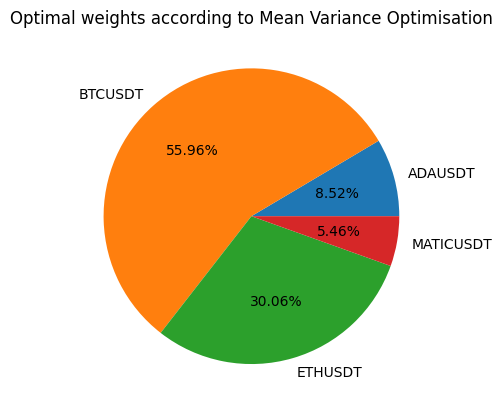

# qml

*Exploring Quantum Machine Learning*

The goal of this project is to solve a problem using classical machine learning and later extend it to explore if it can also be solved using current techniques in quantum machine learning.

## The search of a problem

### Mean Variance Portfolio Optimisation

At first, I started with the problem of **Portfolio Optimisation** which can be found in `notebooks/mean_variance_portfolio.ipynb`, basically it takes historical prices for a basket of assets and gives the optimal allocation for these assets. For example, you feed the model with following asset prices:

1. BTC/USDT
2. ETH/USDT
3. ADA/USDT
4. MATIC/USDT

The model then tells you the optimal allocation of each asset to maximise profit as shown in the plot below:

Note that the plot above uses historical prices from *2022-01-01* to *2024-02-24*. 

However, after achieving it classically I realised that this problem can be solved optimally by using optimisers such as gradient descent, etc. There are not much machine learning involved hence when this problem translates to the quantum space, all it needs is a quantum optimiser. In other words, the solution to the problem is not as interesting that I expected it to be and at that moment I set out to look for other problems to solve.

### General Adversiaral Networks (GANs) 

After reading a few papers [[1](#1), [2](#2)] and looking at several online resources [[3](#3), [4](#4)] I found that there were successful records of translating GANs into the quantum space and it is definitely a more sophiscated problem than mere optimisation. Since GANs is a variation of neural networks it involves learning usually through backpropagation that minimises the loss function, that implies that in order to achieve GANs in the quantum world, it is essential to implement a learning algorithm suitable in the quantum space and exploring how quantum learning works is a good enough reason for me to consider this problem.

### Phase 1

The plan is to first train a simple GAN classically using the [MNIST](https://archive.ics.uci.edu/dataset/683/mnist+database+of+handwritten+digits) dataset with the goal of generating handwritten digits images. Then with the help of PennyLane, replace parts of the classical code to use quantum circuits to turn the model into a qGAN.

- [Qiskit Torch Connector and Hybrid QNNs with MNIST](https://qiskit-community.github.io/qiskit-machine-learning/tutorials/05_torch_connector.html)
- [Quantum Restricted Boltzmann Machines on MNIST](https://github.com/mareksubocz/QRBM-qiskit/blob/master/machine-learning-qiskit-pytorch-fixed-working-copy-3-digits-try.ipynb)

### Phase 2

Construct an Option Pricing model to with GAN using historical price data then similar to Phase 1, use PennyLane to turn that model to a qGAN.

- [Deep Learning for Option Pricing](https://blog.dataiku.com/using-deep-learning-for-better-option-pricing)

## References

<a id="1">[1]</a>
*Biamonte, J., Wittek, P., Pancotti, N., Rebentrost, P., Wiebe, N., & Lloyd, S.* (2017). **Quantum machine learning**. In Nature (Vol. 549, Issue 7671, pp. 195–202). Springer Science and Business Media LLC. 

<a id="2">[2]</a>
*Pistoia, M., Ahmad, S. F., Ajagekar, A., Buts, A., Chakrabarti, S., Herman, D., Hu, S., Jena, A., Minssen, P., Niroula, P., Rattew, A., Sun, Y., & Yalovetzky, R.* (2021). **Quantum Machine Learning for Finance (Version 1)**. arXiv. 

<a id="3">[3]</a>
*Ellis, J.* (2022). **Quantum GANs**. PennyLane Blog. [https://pennylane.ai/qml/demos/tutorial_quantum_gans](https://pennylane.ai/qml/demos/tutorial_quantum_gans)

<a id="4">[4]</a>
*Severus*. (2023). *Open DeepLearning - Quantum Machine Learning*. [https://www.openmlguide.org/ai-portal-gun/quantum-machine-learning](https://www.openmlguide.org/ai-portal-gun/quantum-machine-learning)